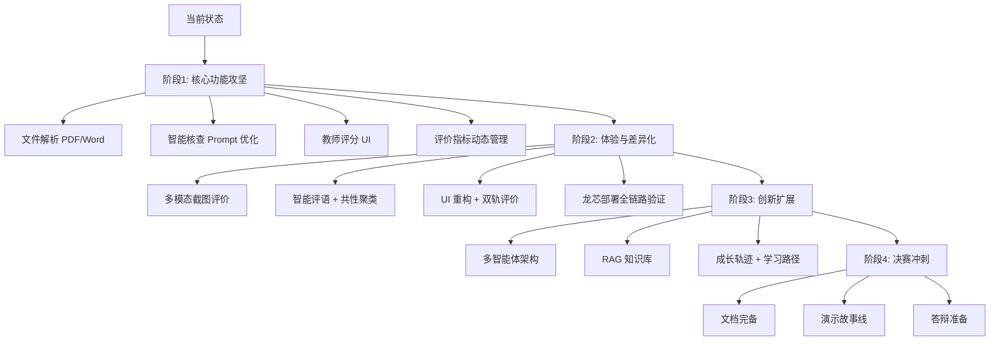

# 软件实训教学智能评价系统 — 产品路线图与全生命周期计划

**项目名称**：基于大模型技术的软件实训教学结果检查评价与报表系统  
**赛题**：第十五届中国软件杯 B组（高职）— 龙芯中科  
**版本**：v1.0  
**日期**：2026-07-06  
**北极星指标**：从提交到生成带图表报告的全流程自动化率 ≥ 90%

---

## 一、产品定位（一句话新闻稿）

> **软件实训教学智能评价系统** 是一个部署在龙芯+麒麟平台上的 B/S 架构 Web 系统，教师上传学生的实训成果（代码/文档/截图），系统自动调用大模型进行文件解析、智能核查、多维度评价，最终生成带图表的 Excel/PDF 评价报告，同时保留教师和企业导师的主观评分入口——实现"上传即评价，评价即报告"的闭环体验。

**目标用户群**：高职院校实训指导教师、校企协同实训中的企业导师、参与实训的学生

---

## 二、北极星指标与支撑看板

| 指标 | 当前值 | 目标值（上线 90 天） | 趋势 |
|------|--------|-------------------|------|
| 全流程自动化率（提交→报告生成无需人工干预） | ~40% | ≥ 90% | ↑ |
| 大模型评价与教师评分的相关系数 | ~0.6 | ≥ 0.85 | ↑ |
| 学生成果解析成功率 | ~30%（仅 txt/csv） | ≥ 95%（含 PDF/Word/截图） | ↑ |
| 教师创建实训 → 发布报告的平均耗时 | 未度量 | < 5 分钟 | ↓ |
| 学生提交后获取评价的等待时间 | 未度量 | < 60 秒 | ↓ |

---

## 三、产品全生命周期阶段规划

### 阶段 0：现状诊断（已完成）

| 维度 | 状态 |
|------|------|
| 后端基础框架 | ✅ Python HTTP Server，RESTful 路由，MySQL + SQLite 双模 |
| 用户系统 | ✅ 教师/管理员/学生，登录与权限 |
| 实训管理 | ✅ 创建实训、学生提交、文件上传 |
| 评价引擎 | ✅ 自定义指标+权重，大模型评分+教师主观分 |
| 报表生成 | ✅ 个体报告+班级统计，Excel/PDF 图表 |
| 文件解析 | ⚠️ 仅支持 txt/csv，PDF/Word/截图未实现 |
| 智能核查 | ⚠️ 基础实现，缺少语义级漏洞识别 |
| 多模态 | ❌ 不支持截图/图片分析 |
| 多智能体 | ❌ 无多智能体协作架构 |
| UI 精细度 | ⚠️ 基础可用，交互待优化 |
| 部署验证 | ❌ 未在龙芯+麒麟环境完成全链路验证 |

---

### 阶段 1：核心功能攻坚（Now — 当前 Sprint，2 周）

**目标**：补齐五大功能中的缺失环节，确保评分逻辑闭环跑通。

| 项目 | 用户问题 | 成功指标 | Owner | ETA |
|------|---------|---------|-------|-----|
| **文件解析系统升级** | 只支持 txt/csv，学生提交的 PDF/Word/截图无法自动解析 | PDF 解析成功率 ≥ 90%、Word 解析成功率 ≥ 90% | 后端 | Week 1 |
| **智能核查 V1** | 核查只有分数没有原因，缺少逻辑漏洞提醒 | 每条评价附带 ≥ 2 条具体扣分原因 | 后端+LLM | Week 1 |
| **教师主观评分流程** | 教师无法在页面上直接打分和写评语 | 教师评分入口完整可用，评分后自动加权计算总分 | 全栈 | Week 2 |
| **学生端提交流程** | 学生提交界面不够清晰，小组提交模式未验证 | 学生能顺利上传代码/文档/截图三类文件 | 全栈 | Week 2 |
| **评价指标管理** | 指标固定在代码中，教师无法动态调整 | 支持增删改评价指标+权重+自动/手动类型 | 全栈 | Week 1 |

**发布门禁**：核心评价流程（提交→解析→评价→报告）在本地开发环境完整跑通

---

### 阶段 2：体验与差异化（Next — 未来 1~2 个季度）

**目标**：从"能用"到"好用"，打造差异化竞争力。

| 项目 | 假设 | 预期结果 | 信心 | 阻塞 |
|------|------|---------|------|------|
| **多模态评价** | 大模型分析截图能判断功能实现度和 UI 一致性 | 截图评价准确率 ≥ 80% | Med | 需要多模态 LLM 接口支持 |
| **智能综合评语** | 为每位学生生成段落式评语，不止分数 | NPS +10 | High | 需要优化 Prompt |
| **共性错误聚类** | 自动归类全班同学的共性错误，教师可一键查看 | 教师每周节省 2 小时批改时间 | High | 需要聚类算法 |
| **异常成果预警** | 自动标记偏差极大的成果推送重点关注列表 | 降低漏判率 50% | Med | 需要阈值模型 |
| **教师端 UI 重构** | 基于 .trae 中的红方案，优化班级→实训→评价三级导航 | 用户任务完成时间降低 30% | High | 需要设计确认 |
| **双轨评价体系** | 支持学校标准和企业标准同时打分 | 校企双方都能用同一系统 | High | 需要业务逻辑设计 |
| **企业导师入口** | 企业导师可以登录系统查看和评分 | 新增企业用户角色 | Med | 需要权限设计 |
| **部署龙芯验证** | 全项目在龙芯+麒麟环境可正常构建和运行 | 一键部署脚本通过验证 | High | 需要龙芯云环境 |

---

### 阶段 3：创新与扩展（Later — 3~6 个月视野）

**战略投注**——当证据或优先级支持时推进。

| 项目 | 战略假设 | 推进所需信号 |
|------|---------|-------------|
| **多智能体协作架构** | 设置代码规范、逻辑漏洞、文档质量等专项评审 Agent，由汇总 Agent 统合输出 | 单 Agent 评价准确率稳定 ≥ 85% |
| **本地专属知识库（RAG）** | 嵌入校方评分标准、企业代码规范，让评价有据可依 | 用户反馈"评价太泛"的工单 > 5 个 |
| **领域模型微调** | 用软件工程领域代码数据微调开源大模型，提升评价专业性 | 通用模型评价满意率 < 70% |
| **个人成长轨迹** | 雷达图展示学生多项能力的历史变化趋势，跨实训对比 | 系统累计运行 ≥ 3 个实训周期 |
| **同辈能力对比** | 展示学生在班级中的能力分布（隐私保护） | 学生端留存率 > 60% |
| **个性化学习路径** | 根据评价结果自动匹配推荐学习资料与微课 | 评价数据积累 ≥ 200 条 |
| **能力图谱岗位映射** | 评价结果对应企业岗位能力图谱，标注达标情况 | 企业导师用户 ≥ 3 个 |
| **模拟企业工作流** | 嵌入"提交→代码审查→评价→复盘"流程 | 基础功能满意度 ≥ 4/5 |

---

### 阶段 4：打磨与决赛冲刺（答辩准备期）

**目标**：文档齐备、演示流畅、故事线清晰。

| 项目 | 要求 | 时间 |
|------|------|------|
| 软件功能需求分析文档 | 完整规范 | 答辩前 3 周 |
| 软件功能设计文档 | 完整规范 | 答辩前 3 周 |
| 软件产品说明书 | 完整规范 | 答辩前 2 周 |
| 软件功能测试报告 | 完整规范 | 答辩前 2 周 |
| 软件安装包及部署文档 | 龙芯验证通过 | 答辩前 1 周 |
| 功能演示 PPT | 故事化呈现 | 答辩前 1 周 |
| 功能演示视频（≤7 分钟） | 情节化 Demo | 答辩前 3 天 |

---

## 四、我们不做的事（以及为什么）

| 请求 | 来源 | 延后原因 | 重新考虑条件 |
|------|------|---------|-------------|
| 移动端 App | 竞赛功能需求 | B/S 架构已满足需求，App 开发成本高且非评分项 | 竞赛明确要求 App 或核心功能满意度 ≥ 4.5 |
| 实时协作编辑 | 团队成员 | 与核心评价功能无关，偏离赛题 | 基础功能全部完成后仍有余力 |
| AI 自动出题 | 拓展思路 | 赛题聚焦"评价"而非"出题"，多模态评价优先级更高 | 用户调研中 30%+ 教师提出需求 |
| 支付/商业化功能 | 商业可行性评分项 | 当前阶段应以功能完整性优先，10% 商业占比无需提前开发 | 基础功能全部完成后 |

---

## 五、开发方向优先级排序

### P0 — 必须完成（竞赛底线）

1. ✅ **B/S 架构 + 龙芯部署验证** — 一票否决红线
2. ✅ **五大功能完整闭环**：上传→解析→核查→评价→报告
3. ✅ **多格式文件支持**：Word/PDF/截图/代码
4. ✅ **自定义评价指标** + 教师主观分入口
5. ✅ **带图表的 Excel/PDF 报告导出**

### P1 — 拉开差距

1. **多模态大模型评价**（截图分析）
2. **智能综合评语生成**
3. **共性错误自动聚类**
4. **异常成果预警**
5. **教师端 UI/UX 优化**（基于 .trae 设计方案）

### P2 — 创新加分

1. 双轨评价体系（学校+企业标准）
2. 企业导师独立入口
3. 成长轨迹可视化
4. 同辈能力对比（隐私保护）
5. Prompt 工程优化（评价专业性）

### P3 — 长期储备

1. 多智能体协作架构
2. RAG 本地知识库
3. 领域模型微调
4. 个性化学习路径推荐
5. 能力图谱岗位映射

---

## 六、推荐技术迭代路线

---

## 七、风险与缓解

| 风险 | 可能性 | 影响 | 缓解措施 |
|------|--------|------|---------|
| 龙芯+麒麟环境兼容性问题 | High | High | 尽早申请龙芯云环境，每周至少验证一次部署 |
| 大模型评价结果不稳定/不准确 | Med | High | Prompt 工程迭代 + 缓存机制 + 教师可覆盖 |
| PDF/Word 解析库在 LoongArch 上无兼容版本 | Med | High | 提前调研 LoongArch 可用库，准备纯 Python 实现兜底 |
| 多模态大模型不支持截图分析 | Low | Med | 使用支持多模态的 API（如通义千问 VL），或转为描述后文本评价 |
| 团队成员精力分散 | Med | Med | 明确 P0/P1 优先级，每周 Sprint 定 Deadlines |

---

*文档版本：v1.0 | 生成日期：2026-07-06 | 作者：Alex（产品经理）*
